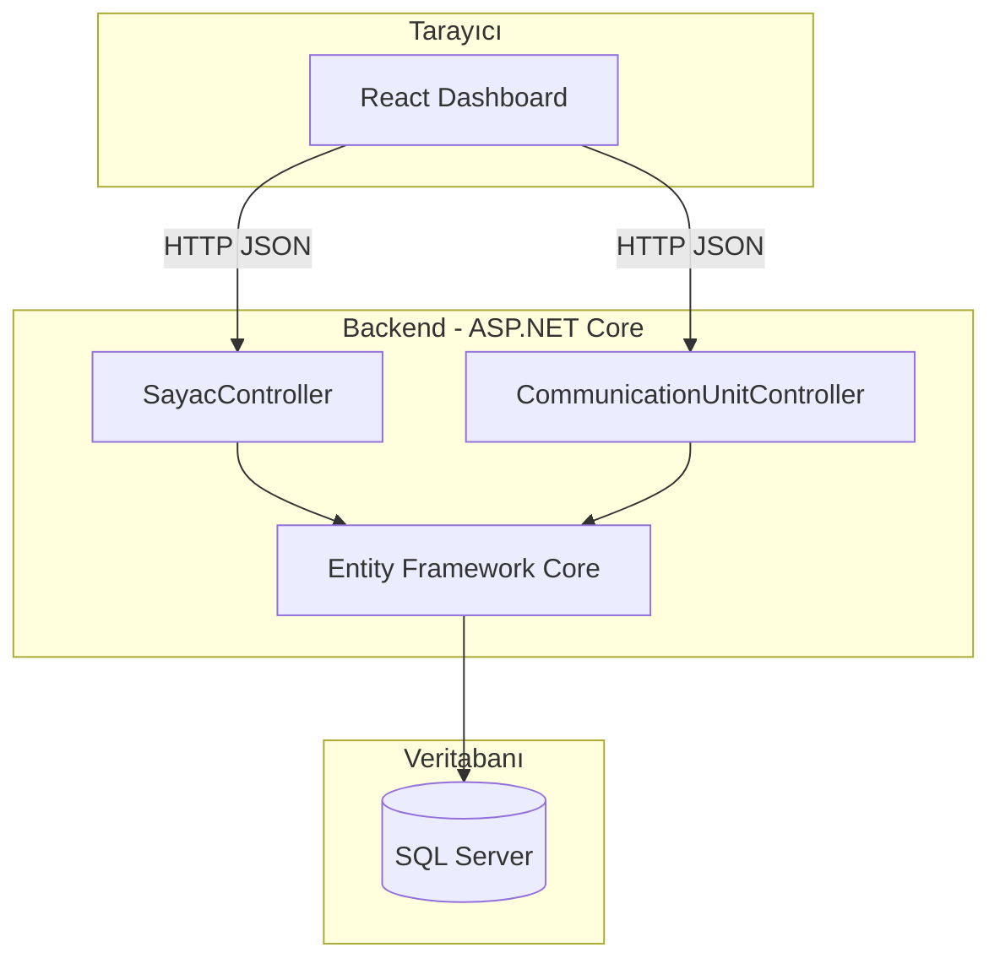

# Sayaç Yönetim Uygulaması

Staj kapsamında geliştirilen, sayaç okumalarını ve saha haberleşme ünitelerini tek panelden yönetmeyi sağlayan full-stack web uygulaması.

[](https://dotnet.microsoft.com/)
[](https://react.dev/)
[](https://www.typescriptlang.org/)
[](https://www.microsoft.com/sql-server)

---

## İçindekiler

- [Genel bakış](#genel-bakış)
- [Özellikler](#özellikler)
- [Teknoloji yığını](#teknoloji-yığını)
- [Mimari](#mimari)
- [Proje yapısı](#proje-yapısı)
- [Gereksinimler](#gereksinimler)
- [Kurulum](#kurulum)
- [Ortam değişkenleri](#ortam-değişkenleri)
- [API referansı](#api-referansı)
- [Üretim derlemesi](#üretim-derlemesi)
- [Sorun giderme](#sorun-giderme)
- [Lisans](#lisans)

---

## Genel bakış

Uygulama iki ana modülden oluşur:

1. **Sayaç okumaları** — Sayaç numarası, okuma değeri ve tarih kayıtlarının listelenmesi, eklenmesi, güncellenmesi ve arşivlenmesi.
2. **Haberleşme üniteleri** — Saha cihazlarının bağlandığı ağ uç noktalarının (ad, IP, port) tanımlanması.

Her sayaç kaydı zorunlu olarak bir haberleşme ünitesine bağlanır. Silme işlemleri fiziksel değil **yumuşak silme** (soft delete) ile yapılır; kayıtlar gerektiğinde geri yüklenebilir.

| Katman | Adres (geliştirme) |
|--------|---------------------|
| Web arayüzü | http://localhost:5173 |
| REST API | http://localhost:5249 |
| Swagger UI | http://localhost:5249/swagger |

---

## Özellikler

### Sayaçlar
- Okuma kaydı oluşturma, düzenleme ve arşivleme
- Haberleşme ünitesine göre ilişkilendirme
- Aktif / silinen kayıt görünümü ve geri yükleme
- Özet kartlar (toplam kayıt, bu ayki okuma, son okuma)
- Sayaç numarası ve ünite adına göre arama
- Tarih, değer ve sayaç numarasına göre sıralama

### Haberleşme üniteleri
- Ünite CRUD (ad, IPv4, port)
- Bağlı sayaç sayısının listelenmesi
- Yumuşak silme ve geri yükleme

### Teknik
- RESTful API + OpenAPI (Swagger)
- Entity Framework Core migrations
- CORS yapılandırması (yerel frontend)
- React Query ile önbellekli veri yönetimi
- Form doğrulama (Zod + react-hook-form)

---

## Teknoloji yığını

| Katman | Teknoliler |
|--------|------------|
| **Backend** | ASP.NET Core 8, Entity Framework Core 9, SQL Server |
| **Frontend** | React 19, TypeScript, Vite 8, TanStack Query, Axios |
| **UI** | Tailwind CSS 4, Radix UI, IBM Plex Sans |
| **Veritabanı** | Microsoft SQL Server (Windows: Express · macOS/Linux: Docker) |

---

## Mimari



---

## Proje yapısı

```
SayacYonetimUygulamasi/
├── backend/
│   ├── Controllers/          # SayacController, CommunicationUnitController
│   ├── Models/               # Meter, CommunicationUnit, DTO'lar
│   ├── Data/                 # AppDbContext
│   ├── Migrations/           # EF Core migration'ları
│   └── Program.cs
├── frontend/
│   ├── src/
│   │   ├── components/       # Sayfa ve UI bileşenleri
│   │   ├── hooks/            # React Query hooks
│   │   ├── lib/              # API istemcisi, validasyon
│   │   └── types/            # TypeScript tipleri
│   └── package.json
└── README.md
```

---

## Gereksinimler

| Araç | Sürüm | Not |
|------|-------|-----|
| [.NET SDK](https://dotnet.microsoft.com/download) | 8.0+ | Backend |
| [Node.js](https://nodejs.org/) | 20+ | Frontend |
| [Docker Desktop](https://www.docker.com/products/docker-desktop/) | Güncel | macOS / Linux için SQL Server |
| SQL Server Express | — | Windows’ta Docker alternatifi |

---

## Kurulum

### 1. Depoyu klonlayın

```bash
git clone https://github.com/oguzgztk/SayacYonetimUygulamasi.git
cd SayacYonetimUygulamasi
```

### 2. Veritabanı

#### macOS / Linux (Docker)

Docker Desktop’u başlatın, ardından:

```bash
docker run -e "ACCEPT_EULA=Y" \
  -e "MSSQL_SA_PASSWORD=YourStrong@Passw0rd" \
  -p 1433:1433 \
  --name sayac-sql \
  -d mcr.microsoft.com/mssql/server:2022-latest
```

Geliştirme bağlantı dizesi `backend/appsettings.Development.json` içinde tanımlıdır (`sa` / `YourStrong@Passw0rd`).

#### Windows

`backend/appsettings.json` içindeki `Server=.\\SQLEXPRESS` bağlantısını kullanabilirsiniz. SQL Server Express kurulu ve çalışır durumda olmalıdır.

### 3. Backend

```bash
cd backend

# İlk kurulumda (isteğe bağlı — dotnet run da migration uygular)
dotnet tool install --global dotnet-ef
export PATH="$PATH:$HOME/.dotnet/tools"   # macOS / Linux
dotnet ef database update

dotnet run
```

API ayakta olduğunda terminalde `Now listening on: http://localhost:5249` görünür.

### 4. Frontend

Yeni bir terminal:

```bash
cd frontend
npm install
npm run dev
```

Tarayıcıda **http://localhost:5173** adresini açın.

### Örnek veri

Veritabanında hiç sayaç kaydı yoksa, backend ilk çalıştırmada otomatik olarak örnek veri yükler:

- **5 aktif** haberleşme ünitesi (+ 1 silinmiş örnek)
- **17 aktif** sayaç okuması (+ 2 silinmiş örnek)

Mevcut veriniz varsa seed atlanır. Sıfırdan denemek için veritabanını drop edip `dotnet ef database update` çalıştırın.

### İlk kullanım sırası

1. Backend’i başlatın — örnek veri yüklendiyse doğrudan listeyi görürsünüz.
2. Boş veritabanında önce **Haberleşme Üniteleri**, sonra **Sayaçlar** ekleyin.

---

## Ortam değişkenleri

### Frontend (`frontend/.env.development`)

```env
VITE_API_URL=http://localhost:5249
```

Örnek dosya: `frontend/.env.example`

### Backend

| Dosya | Ortam | Açıklama |
|-------|-------|----------|
| `appsettings.json` | Tüm | Varsayılan bağlantı (Windows SQLEXPRESS) |
| `appsettings.Development.json` | Development | Docker SQL (`localhost,1433`) |

---

## API referansı

### Sayaçlar — `api/sayac`

| Metot | Endpoint | Açıklama |
|-------|----------|----------|
| `GET` | `/api/sayac` | Aktif sayaç listesi |
| `GET` | `/api/sayac/deleted` | Silinen sayaçlar |
| `GET` | `/api/sayac/{id}` | Tek kayıt |
| `POST` | `/api/sayac` | Yeni kayıt |
| `PUT` | `/api/sayac/{id}` | Güncelle |
| `DELETE` | `/api/sayac/{id}` | Yumuşak sil |
| `POST` | `/api/sayac/{id}/restore` | Geri yükle |
| `DELETE` | `/api/sayac/{id}/permanent` | Kalıcı sil |

**Oluşturma gövdesi (`MeterCreateDto`):**

```json
{
  "meterNumber": "M-1042",
  "readingValue": 1284.50,
  "readingDate": "2025-08-22T10:30:00",
  "communicationUnitId": 1
}
```

### Haberleşme üniteleri — `api/communicationunit`

| Metot | Endpoint | Açıklama |
|-------|----------|----------|
| `GET` | `/api/communicationunit` | Aktif üniteler |
| `GET` | `/api/communicationunit/deleted` | Silinen üniteler |
| `GET` | `/api/communicationunit/{id}` | Tek ünite |
| `POST` | `/api/communicationunit` | Yeni ünite |
| `PUT` | `/api/communicationunit/{id}` | Güncelle |
| `DELETE` | `/api/communicationunit/{id}` | Yumuşak sil |
| `POST` | `/api/communicationunit/{id}/restore` | Geri yükle |

**Oluşturma gövdesi:**

```json
{
  "name": "Merkez RTU",
  "ipAddress": "192.168.1.10",
  "port": 502
}
```

İnteraktif dokümantasyon: **http://localhost:5249/swagger**

---

## Üretim derlemesi

```bash
# Frontend
cd frontend && npm run build
# Çıktı: frontend/dist/

# Backend
cd backend && dotnet publish -c Release -o ./publish
```

Üretimde CORS kökenlerini (`Program.cs`) ve `VITE_API_URL` değerini dağıtım adresinize göre güncelleyin.

---

## Sorun giderme

| Belirti | Olası neden | Çözüm |
|---------|-------------|--------|
| `command not found: dotnet` | .NET SDK yok | [.NET 8 SDK](https://dotnet.microsoft.com/download) kurun |
| `command not found: docker` | Docker yok / kapalı | Docker Desktop kurun ve uygulamayı açın |
| API 500 — `Login failed for user 'sa'` | Şifre uyuşmuyor | Docker şifresi ile `appsettings.Development.json` aynı olmalı |
| API 500 — `Cannot open database SayacDb` | Migration uygulanmamış | `dotnet ef database update` veya `dotnet run` |
| `dotnet ef` bulunamadı | EF aracı yok | `dotnet tool install --global dotnet-ef` |
| Frontend “API bağlantısı kurulamadı” | Backend kapalı | `dotnet run` ile API’yi başlatın |
| Sayaç eklenemiyor | Ünite yok | Önce haberleşme ünitesi ekleyin |

---

## Lisans

Bu proje eğitim / staj amaçlı geliştirilmiştir. Ticari kullanım için lisans koşullarını proje sahibiyle netleştirin.

---

**Geliştirici:** [oguzgztk](https://github.com/oguzgztk)
